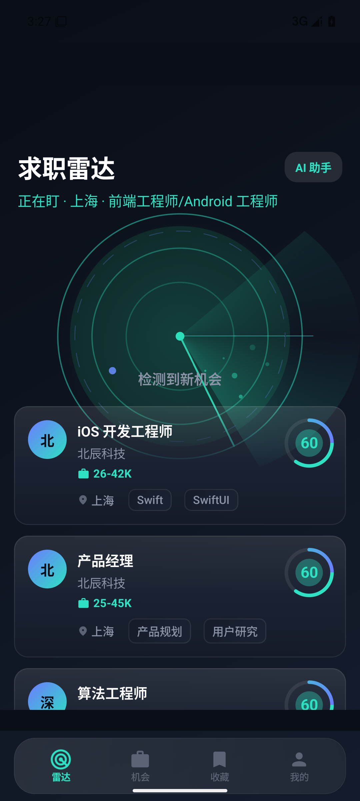

# 求职雷达 JobRadar

> **管理求职生命周期，而不是只找工作。**
> 一个真正端手一体的 AI 求职产品：Android 原生 + Web + 后端 + AI Agent。干净、克制、极致。

求职雷达不是想帮你"搜到一份工作"，而是想帮你**manage 整个求职过程**——收藏、投递记录、面试、Offer、AI 建议、公司画像、时间线、提醒，一屏管理，端手实时同步。它证明了两件事：**你会做 AI Agent，也会做真正的软件。**

<p align="center">
  
</p>

---

## ✨ 为什么是它

- **端手一体**：Android 原生（Kotlin/Compose）+ Web（Next.js）+ 后端（Spring Boot），同一套 `{ code, message, data }` 契约，全端实时同步。
- **AI 原生**：AI 助手接本地知识库（AnythingLLM + RAG）、JD 分析、岗位匹配度、公司画像——AI 不是噱头，是让体验更好的能力层。
- **可插拔数据源**：`JobProvider` 接口，Boss/智联/猎聘/官网都是 **future plugin**，产品本身完全不知道数据从哪来。第一阶段用 Mock + 可插拔，绝不碰爬虫。
- **深邃的工程**：Clean Architecture + MVI 单向数据流 + Hilt + 契约层 + 单元/集成测试 + Lint 0 错误。

---

## 🗺 版本路线图（做产品，不是做项目）

| 版本 | 能力 |
|------|------|
| **v0.1** | 搜索 / 筛选 / 收藏 / 投递记录 / Android+Web 同步（MVP） |
| **v0.2** | AI 岗位分析 / 匹配度 / 公司画像 |
| **v0.3** | Offer 比较 / 面试记录 |
| **v0.4** | 职位订阅 / 提醒 |
| **v0.5** | AI 简历优化 |
| **v1.0** | Agent（自动搜索/推荐/授权投递） |

> 当前进度：**v0.1**（搜索/收藏/同步 + 完整端手骨架已跑通）

---

## 🚀 3 分钟跑起来（Docker 一键）

```bash
# 1) 起后端（内置 H2 + Mock 数据源，零配置）
cd backend
./gradlew bootRun            # http://localhost:8080

# 2) Android（Android Studio 打开 android/ 直接运行）
cd android
./gradlew :app:assembleDebug :app:testDebugUnitTest
```

> 后端零配置、Mock 数据开箱即用；Android 无需任何外部依赖即可跑。这就是「别人能跑」的最低门槛。

---

## 🧱 架构

```
Android (Kotlin/Compose/MVI)   Web (Next.js)
          │        ★ 端手同步         │
          ▼                          ▼
     Backend (Spring Boot)
  { code, message, data } 契约 · WebSocket 实时推送
          │
          ▼
  JobProvider (可插拔)   ──►  Mock · CSV · RSS · Boss · Liepin(未来)
          │
          ▼
  AI 层 · LLM 网关 · RAG 知识库 · Agent
```

- **契约统一**：所有端走 `{ code, message, data }`，字段 `snake_case`，一处解包，全端一致。
- **数据源抽象**：`JobProvider.search()/detail()/company()`，数据来源完全插件化。
- **AI 纵深**：LLM 网关（LiteLLM）· RAG（AnythingLLM）· Agent 编排（王庭技术沉淀）。

---

## 📁 结构

| 目录 | 说明 |
|------|------|
| `android/` | 原生 Android 应用（Kotlin · Jetpack Compose · MVI · Hilt · Clean Arch） |
| `backend/` | Kotlin + Spring Boot 后端（REST 契约 · WebSocket · JobProvider · AI 网关） |
| `ios/` | iOS 工程（规划或后续） |
| `docs/` | 方向总纲 / 设计系统规范 |
| `fedata/` | 演示数据 |

---

## 🧪 质量

- **后端**：单元 + 集成测试（含 `@SpringBootTest` 真实启动验证契约）
- **Android**：ViewModel / domain / mapper 单测；Lint 0 错误
- **契约**：双端统一 `{ code, message, data }` 信封

---

## 📄 License

MIT

---

## 🙌 关于

这个项目是一个独立作者的公开作品。它同时承载一个意图——**用持续、真实、有人用的作品，去证明能力本身，而不止于一张学历**。

如果你觉得有用，欢迎 star；如果你发现问题，欢迎提 Issue——**真正的产品，从第一批用户开始。**

- 📅 [CHANGELOG](CHANGELOG.md) · v0.1 · Foundation
- 🗺 [ROADMAP](ROADMAP.md) · v0.1 → v1.0 Agent
- 🤝 [CONTRIBUTING](CONTRIBUTING.md) · [CODE_OF_CONDUCT](CODE_OF_CONDUCT.md)
