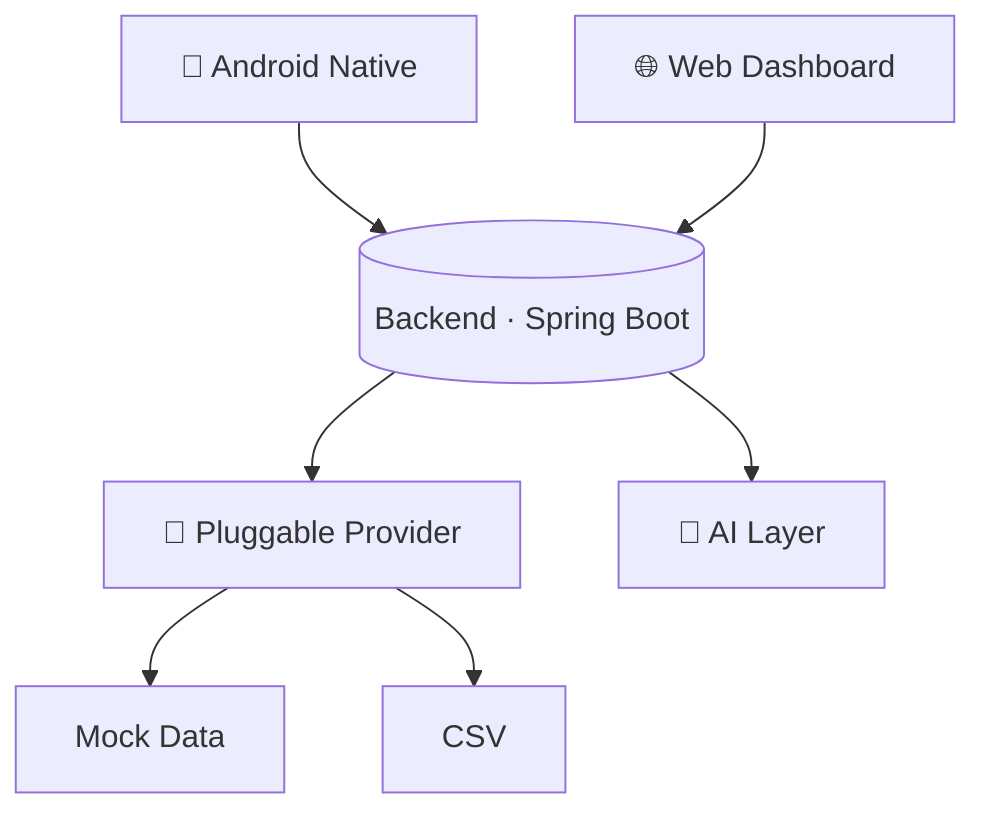

<p align="center">
  
</p>

<h1 align="center">候风 <span style="font-weight:300;color:#8a94a6">JobRadar</span></h1>

<p align="center">
  <b>风未至，而先知其向。</b><br/>
  <span style="font-size:0.9em;color:#8a94a6">候风 · 感知世界即将发生什么 —— 提前发现机会，而不是搜索岗位。</span>
</p>

<p align="center">
  <b>Manage your job hunting lifecycle, not just job search.</b><br/>
  <span style="font-size:0.9em;color:#8a94a6">An AI-native workspace for your entire job hunting journey — from discovering opportunities to tracking interviews and offers.</span>
</p>

<p align="center">
  <a href="#quick-start"><b>Quick Start</b></a> · <a href="ROADMAP.md">Roadmap</a>
</p>

<p align="center">
  
</p>

---

## Features

- 📱 **Native Android App** - Kotlin · Jetpack Compose · MVI
- 🌐 **Web Dashboard** - Next.js · real-time sync across devices
- 🤖 **AI Insights** - job analysis · match score · company profile
- 📊 **Job Pipeline** - favorite → apply → interview → offer
- 📄 **Resume Workspace** - your resume, part of the product
- 🔌 **Pluggable Providers** - job data sources are swappable plugins

---

## Quick Start

```bash
# Backend (zero-config · Mock data)
cd backend && ./gradlew bootRun
# Web
cd web && pnpm install && pnpm dev
# Android
cd android && ./gradlew :app:assembleDebug
```

---

## Architecture



One shared contract `{ code, message, data }` · real-time sync · data sources fully pluggable.

---

## Roadmap

**v0.1 Foundation → v0.2 Connect → v0.3 Insight → v0.4 Automation → v1.0 Agent**

- ✅ **v0.1 · Foundation** - end-to-end skeleton · pluggable data source
- ✅ **v0.2 · Connect** - Web / App / Backend data pipeline linked
- 🔜 **v0.3 · Insight** - AI makes jobs understandable & comparable
- ⏳ **v0.4 · Automation** - subscription / reminder / interview log
- ⏳ **v1.0 · Agent** - auto search / recommend / authorized apply

---

## Why JobRadar

Job hunting is not just "searching for a job" - it is **managing the whole journey from apply to offer**. 候风 helps you manage your career like a product, with AI applied to real decisions.

---

## License

MIT

---

## Contributing

- [Contributing guide](CONTRIBUTING.md) · [Code of Conduct](CODE_OF_CONDUCT.md)

---

<p align="center">
  <b>风未至，而先知其向。</b><br/>
  真正的产品，从第一批用户开始。若你觉得有用，欢迎 ⭐；有问题，欢迎提 <a href="https://github.com/yanghaozhe883/job-radar/issues">Issue</a>。
</p>
