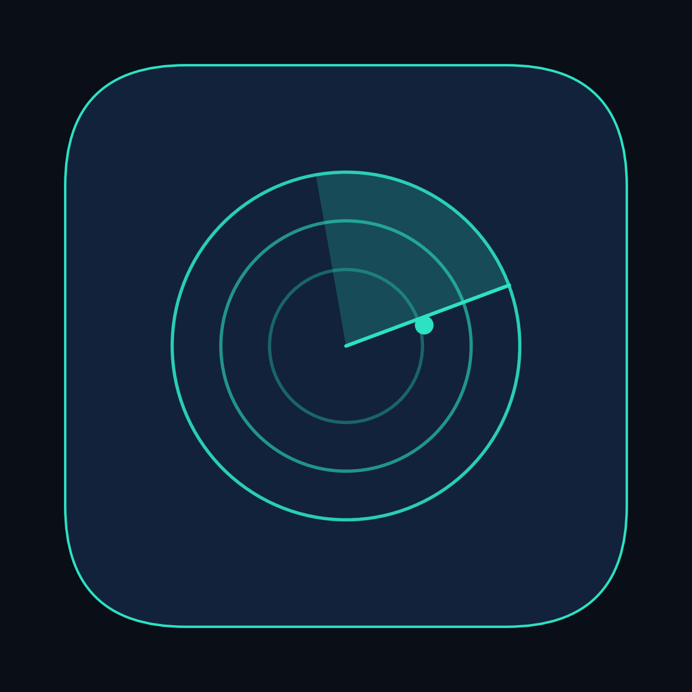
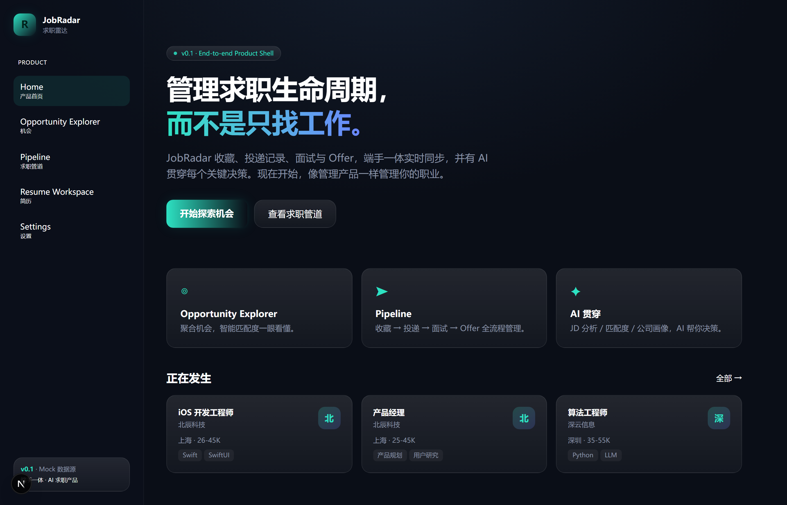
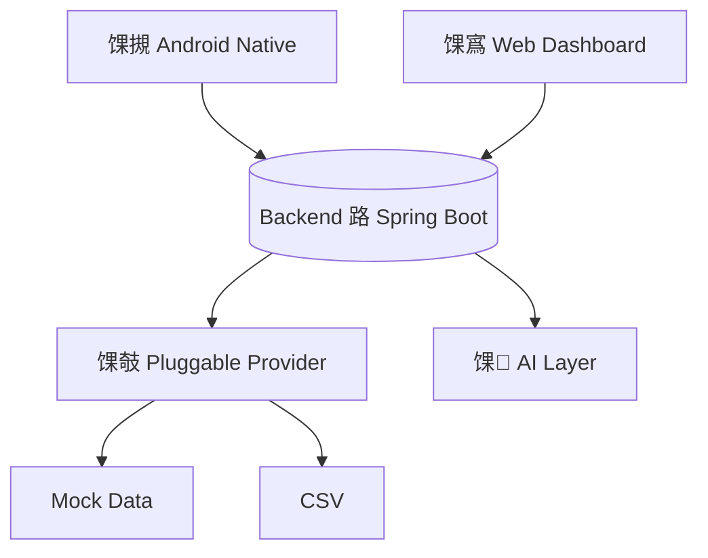

<p align="center">
  
</p>

<h1 align="center">JobRadar 路 姹傝亴闆疯揪</h1>

<p align="center">
  <b>Manage your job hunting lifecycle, not just job search.</b><br/>
  绔墜涓€浣撶殑 AI 姹傝亴宸ヤ綔鍙?鈥斺€?浠庡彂鐜版満浼氬埌璺熻釜闈㈣瘯涓?Offer锛屼竴灞忕鐞嗐€?</p>

<p align="center">
  <a href="#-quick-start"><b>Quick Start</b></a> 路 <a href="https://jobradar.dev">Live Demo</a> 路 <a href="ROADMAP.md">Roadmap</a>
</p>

<p align="center">
  
</p>

---

## 鉁?Features

- 馃摫 **Native Android App** 鈥?Kotlin 路 Jetpack Compose 路 MVI
- 馃寪 **Web Dashboard** 鈥?Next.js 路 绔墜瀹炴椂鍚屾
- 馃 **AI Insights** 鈥?宀椾綅鍒嗘瀽 路 鍖归厤搴?路 鍏徃鐢诲儚
- 馃搳 **Job Pipeline** 鈥?鏀惰棌 鈫?鎶曢€?鈫?闈㈣瘯 鈫?Offer
- 馃搫 **Resume Workspace** 鈥?浣犵殑绠€鍘嗭紝涔熸槸浜у搧鐨勪竴閮ㄥ垎
- 馃攲 **Pluggable Providers** 鈥?鑱屼綅鏁版嵁婧愬彲鎻掓嫈

---

## 馃殌 Quick Start

```bash
# 鍚庣锛堥浂閰嶇疆 路 Mock 鏁版嵁锛?cd backend && ./gradlew bootRun
# Web
cd web && pnpm install && pnpm dev
# Android
cd android && ./gradlew :app:assembleDebug
```

---

## 馃П Architecture



涓€濂楁暟鎹绾?**`{ code, message, data }`** 路 鍏ㄧ瀹炴椂鍚屾 路 鏁版嵁鏉ユ簮瀹屽叏鎻掍欢鍖栥€?
---

## 馃椇 Roadmap

**v0.1 Foundation 鈫?v0.2 Connect 鈫?v0.3 Insight 鈫?v0.4 Automation 鈫?v1.0 Agent**

| 鐗堟湰 | 閲岀▼纰?|
|------|--------|
| 鉁?v0.1 | Foundation 路 绔墜涓€浣撻鏋?路 鍙彃鎷旀暟鎹簮 |
| 鉁?v0.2 | Connect 路 Web/App/鍚庣 鏁版嵁閾捐矾鎵撻€?|
| 馃敎 v0.3 | Insight 路 AI 璁╁矖浣嶅彲鐞嗚В銆佸彲姣旇緝 |
| 鈴?v0.4 | Automation 路 璁㈤槄 / 鎻愰啋 / 闈㈣瘯璁板綍 |
| 鈴?v1.0 | Agent 路 鑷姩鎼滅储 / 鎺ㄨ崘 / 鎺堟潈鎶曢€?|

---

## 馃挱 Why JobRadar

鐪熸鐨勬眰鑱岋紝涓嶆槸"鎼滃埌涓€浠藉伐浣?锛岃€屾槸**manage 鏁翠釜浠庢姇閫掑埌 offer 鐨勮繃绋?*銆侸obRadar 鍍忕鐞嗕竴涓骇鍝佷竴鏍凤紝绠＄悊浣犵殑鑱屼笟鈥斺€旇€?AI 鐢ㄥ湪鍏抽敭鍐崇瓥涓婏紝鑰屼笉鏄櫔浣犻棽鑱娿€?
---

## 馃搫 License & Contributing

MIT 路 [Contributing](CONTRIBUTING.md) 路 [Code of Conduct](CODE_OF_CONDUCT.md)

---

<p align="center">
  <b>鐪熸鐨勪骇鍝侊紝浠庣涓€鎵圭敤鎴峰紑濮嬨€?/b><br/>
  濡傛灉浣犺寰楁湁鐢紝娆㈣繋 猸?Star锛涙湁闂锛屾杩庢彁 <a href="https://github.com/yanghaozhe883/job-radar/issues">Issue</a>銆?</p>
